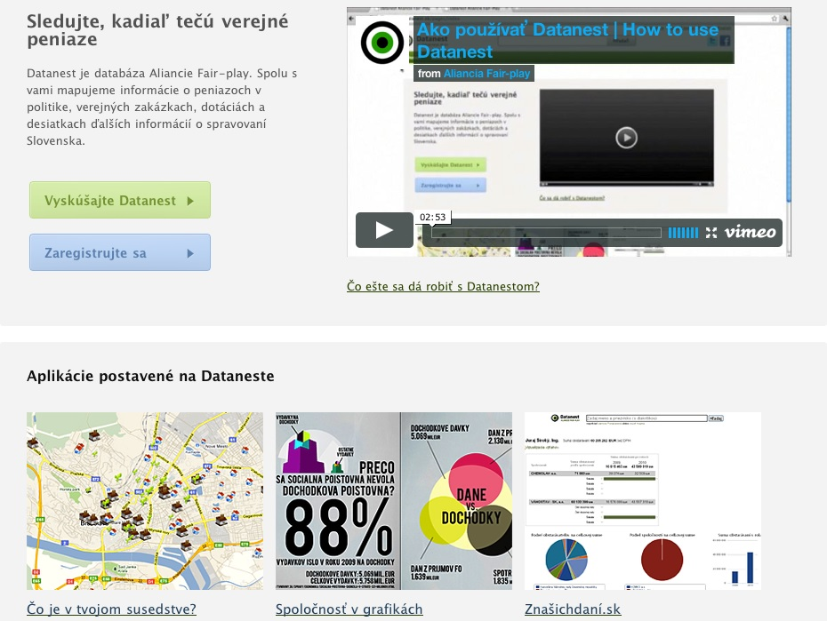
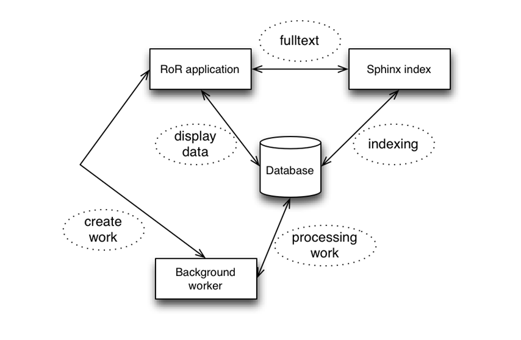

# Introduction and overview

## Intro

Datacamp is a Web application for publishing, searching and managing data in form of datasets.

## Overview 

The project consists of multiple parts:

- three databases
- Ruby on Rails (RoR) management and presentation application
- sphinx fulltext search
- backround worker

### Databases

- *app* - the database is used to store metainformation about the actual database being presented. It is also used to store users and their permissions as well as other kinds of information about the application.
- *data* - the database is where the data for the datasets is stored. The datasets are standard mysql tables that have a ‘ds_’ prefix and a record in the app database. For more information about the structure of the database please consult the developer documentation.
- *staging* - the database is used while automatically scraping some sites as a staging area before the data is published. Normal users do not need to be concerned about the database. For more information about the contents of the staging database please consult the developer documentation.

### RoR application

The application manages/presents and logs the data in a way that is accessible to all kinds of us-ers, from journalists to developers. The app uses information stored in the app database to present the data in the data database.

### Fulltext search

Fulltext search is done with an external library (sphinx). The search library indexes the data to provide a fast and reliable fulltext listing for a query. 

### Background worker

The application uses the background worker to process automated downloads, import data etc. The application itself does not depend on a running worker process. Full functionality can be achieved only with the background worker running.
