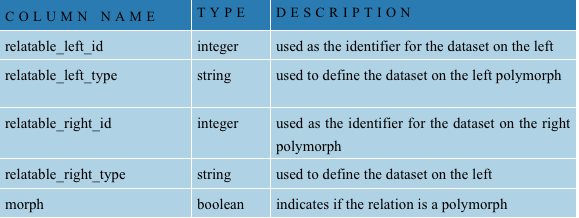

# Introduction and overview

Datacamp is a Web application for publishing, searching and managing data in form of datasets.

# Overview 

The project consists of multiple parts:

- three databases
- Ruby on Rails (RoR) management and presentation application
- sphinx fulltext search
- background workers

## Databases

- *app* - the database is used to store metainformation about the actual database being presented. It is also used to store users and their permissions as well as other kinds of information about the application.
- *data* - the database is where the data for the datasets is stored. The datasets are standard mysql tables that have a ‘ds_’ prefix and a record in the app database. For more information about the structure of the database please consult the developer documentation.
- *staging* - the database is used while automatically scraping some sites as a staging area before the data is published. Normal users do not need to be concerned about the database. For more information about the contents of the staging database please consult the developer documentation.

## RoR application

The application manages/presents and logs the data in a way that is accessible to all kinds of users, from journalists to developers. The app uses information stored in the app database to present the data in the data database. Detailed info about user roles can be found [here](roles.md).

## Fulltext search

Fulltext search is done with an external library (sphinx). The search library indexes the data to provide a fast and reliable fulltext listing for a query. 

## Background workers

The application uses the background workers to process automated downloads, import data etc. The application itself does not depend on a running worker process. Full functionality can be achieved only with the background worker running.

# Developer information

This section covers the applications internal structure and is intended for developers who wish to understands how the application works so they can modify the behavior.

## App database structure

In order to better understand the application, this section serves as an overview to the applications database structure. Note: documentation field are not used for any logic in the application.

### DatasetDescription

Table containing metadata about the dataset. Most of the information is stored for informational purposes. Important columns containing data relevant to the application are database, identifier and is_active.

### TableName::Translations

Tables containing translations of the title and description for the languages the application supports (slovak, english). This table is used by the globalize3 plugin. For more information about the plugin visit [https://github.com/svenfuchs/globalize3](https://github.com/svenfuchs/globalize3) [.](https://github.com/svenfuchs/globalize3) Each table that contains multilanguage records has a translations table attached to id (e.g. FieldDescription::Translations, DatasetDescription::Translations).

### FieldDescription

Table contains description of the columns of a dataset. The description contains various information used in the application such as display name, formatting and accessibility to various users and in various modes.

### DataFormat

Table contains the formats that are used to format FieldDescriptions. The name column is used to determine how to format the field description.

### User rights

The table contains registered users.

### Relations

Relations between dataset records are implemented atop the Rails Activerecord has_many_through relations (see [http://api.rubyonrails.org/classes/ActiveRecord/Associations/ClassMethods.html](http://api.rubyonrails.org/classes/ActiveRecord/Associations/ClassMethods.html)). The data database contains a table where the relations between records are stored. Since there is a single table rails polymorphic associations need to be used to defined which dataset the id belongs to (see

[http://guides.rubyonrails.org/association_basics.html#](http://guides.rubyonrails.org/association_basics.html#)polymorphic-associations).

To determine which of the datasets belongs on the left/right a simple asciisort is used on the dataset identifiers (e.g. 'lawyers' identifier is on the right if the related dataset has an 'associates' identifier).

## ETL

An important infrastructure part of the application is the ETL (Extraction Transformation and Loading framework). Its purpose is to provide automated scheduled background data processing.

The ETL is present in the datanest application itself. Currently it is used to scrape and import data from predefined sites using custom scrapers and import the data to the data database. For convenience, the scrapers are placed in the lib/etl folder and called via rake tasks in the lib/tasks/etl.rake file.

### ETL job worker

An ETL job worker is usually a web scraper and a parser of data. We provide a template class which encapsulates the basic functionality and some helper methods.

### Running a job

In order to manually start one of the preexisting jobs no additional software needs to be installed on the machine. If the project is hosted on a server in a production environment, we recommend scheduling cron jobs to periodically run the ETL jobs.

Running some jobs requires configuration data in the app database in the etl_configurations table.

These jobs scrape detail screens of sites sequentially by id in batches and stop if the IDs stop producing valid screens. This is done because the sites being crawled do not have a good index page to retrieve hyperlinks to the detail pages that are being scraped. The etl_configurations table contains information the jobs need in order to continue processing or stop.

- `name` - identifier of the job being processed. Job workers find configurations by this column
- `start_id` - indicates the start id of the batch being processed
- `batch_limit` - indicates the size of the batch being currently processed
- `last_processed_id` - is updated everytime a job finishes processing a page. If this number exceeds the start_id+batch_limit a new batch is created if there were valid screens in the last batch, or stops

The jobs that ship with the datanest application contain two production ready jobs with rake tasks to run them. Ensure that the backround processor is running (see installation for more information) and run one the rake tasks in the lib/tasks/etl.rake

	$ rake etl:vvo_extraction

This will enque the batch and start processing data while there are valid paged to be processed. The two jobs that currently ship with the application require a staging database that needs to be initialized (see installation for more information).

*Note: Depending on the job there needs to be data tables in the data database.*

### ETL Parsers

Some scrapers was supplied from external developer and was integrated in datanest. Parsers are in models directory (models/parsers/). Parsers not run automatically with crons. Parsers are available in web app in section "parsers". Parser can run with specific  settings (for example year in donation parser).

Parser identification is in etl configuration table. In addition, the table etl_configurations contains the following entries:

- `parser` - indicates whether is a parser
- `last_run_time` - indicates the last run time of parser
- `status` - present state of parser (states are: ready, in_progress, done, failed)
- `download_path` - serialize array of files, which can be downloaded

*Note: Depending on the job there needs to be data tables in the data database.*

### Extractor class

To create a job worker we recommend subclassing the Etl::Extractor class. The framework uses an external library to do the job processing (see

[http://rubygems.org/gems/delayed_job](http://rubygems.org/gems/delayed_job) for mode information). In order to create the processors to meet the needs of the library the Extractor provides methods that subclasses of the class can (and should) use:

- `download(id)` - downloads a website containing data to be scraped. The subclass needs to have the document(id) method implemented.
- `update_last_processed` - updates the last processed id to the currently processed page. The subclass needs to have the config method implemented.
- `perform` - delayed_job uses this to run the job.
- `after(job)` - is used to determine if a new batch of documents should be downloaded.
- `last_run_report` - contains report about this run (its specific for each) parser

### ETL Scrapers

The first ETL At the time of writing this document, there are two scrapers for data was VvoExtraction and RegisExtraction. Both extract data from sites and do so in a two step manner. They first download new data into a staging database and then transfer the new data into the data database. The project is in the process of deprecating the staging database, but due to the fact that these jobs depend on it, the staging database is still required to run them.

Other recent ETL scrapers for data use only data database. Actual ETL scrapers for data are:

- Vvo jobs - VvoExtractor, VvoBulletinExtractor, VvoChecker, VvoLoading
- Regis jobs
- Executor job
- Lawyer jobs
- Notari jobs
- Otvorenezmluvy job
- Foundation job

*Each scrapers run in other interval (see installation - cron for more information).*

### VVO jobs

The first part of the download is where the job processor is used. The download saves the data into the sta_procurements table in the staging database. The newly downloaded data does not have etl_loaded_date column filled out (set to null). To run this step use:

	$ rake etl:vvo_extraction   //run every day at 1:30 am

The seccond step of the download is mostly a rake task that uses raw SQL to copy the newly downloaded data to the data database and set the etl_loaded_date column to the current date, indicating that the data was already loaded.

	$ rake etl:vvo_loading    //run every day at 2:30am

Each month run the bulletin extractor - extract all bulletins in current year and then find procurements with prefix "v". Extractor try download each procurements. Its possible that structure will be changed. After every moth run - datanest send report with all errors / success messages (parse all bulletins page, parse each bulletins pages, parse procurement page). In this way its necessary while downloading procurement page exist and have correct structure. If during this downloading vvo by bulletins was any problem - it will be in report.

	$ rake etl:vvo_current_bulletins_extraction  //run 30 days at 2:00am

After bulletin extractor, datanest send report with last status.

	$ rake etl:vvo_bulletin_report    //run 30 days at 6:00am

### Regis jobs

The first part of the download is where the job processor is used. The download saves the data into the sta_organizations table in the staging database. The newly downloaded data does not have etl_loaded_date column filled out (set to null). To run this step use:

	$ rake etl:regis_extraction   //run every day at 1:30 am

Organizations in dataset may change. The next step in scraper is update organizations which change attributes: name or date_end.

	$ rake etl:regis_update   //run every day at 1:30 am

The seccond step of the download is mostly a rake task that uses raw SQL to copy the newly downloaded data to the data database and set the etl_loaded_date column to the current date, indicating that the data was already loaded.

	$ rake etl:regis_loading   //run every day at 2:30 am

### Executor job

The download saves the data into ds_executors table and publish data or archive data.

	$ rake etl:executor_extraction   //run every 25 days at 0:00 am

### Lawyer jobs

The download saves the data into ds_lawyers table and publish data or archive data.

	$ rake etl:lawyer_extraction   //run every 25 days at 0:00 am

The download saves the data into ds_lawyer_partnerships table and publish data or archive data.

	$ rake etl:lawyer_partnership_extraction //run every 25 days at 0:00 am

The download saves the data into ds_lawyer_associates table and publish data or archive data.

	$ rake etl:lawyer_associate_extraction //run every 25 days at 0:00 am

Next rake tasks publish data or archive data.

	$ rake etl:lawyer_associate_morph  //run every 26 days at 0:00 am
	$ rake etl:lawyer_lists    //run every 26 days at 0:00 am

### Notari jobs

The download saves the data into ds_notaries table and publish data or archive.

	$ rake etl:notari_extraction   //run every 25 days at 0:00 am
	$ rake etl:notari_active   //run every 26 days at 0:00 am

### Otvorenezmluvy job

The download saves the data into csv file. Downloaded csv file can import to otvorenezmluvy dataset in app.

	$ rake etl:otvorenezmluvy_extraction  //run every 25 days at 0:00 am

### Foundation job

This job process foundation data from http://www.ives.sk/registre/startrnd.do. The download saves the data into many tables: ds_foundations, ds_foundation_founders, ds_foundation_trustees and ds_foundation_liquidators.

	$ rake etl:foundation_extraction  //run every 30 days at 0:00 am

### Donation parsers

One of the ETL scrapers was supplied from external developer. This parser process donation data from https://registerkultury.gov.sk/granty2013/statistiky_verejne.php.

Donation parser is available in web apps in section "parsers". In this page its possible run parser with specific year. After run this parser, download path will be updated with new csv file path (data from this year). Downloaded csv file can import to donation dataset in app.

*Parser can be executed for years: 2007, 2008, 2009, 2010, 2012 and 2013.*

### Sitemap generator

In datanest sitemap is generated for all public dataset and public record. Sitemap is re-generated each month. From re-generate files (list of url) for each datanest separetly (somtimes multiple files for dataset):

	$ rake sitemap:generate_all_files  //run every 1 month at 4:00

For create actual version of sitemap.xml:

	$ rake sitemap:create_siteme_map  //run every 1 month at 5:00

